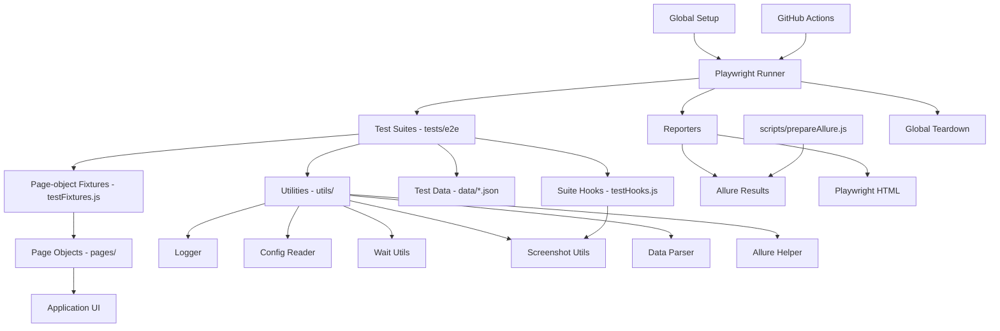

# Architecture

## Application Under Test

- **Website:** SauceDemo
- **URL:** https://www.saucedemo.com
- **Reason:** Widely used, reputable, and stable for UI automation practice.

## High-level diagram



## Execution flow

```text
Global Setup (create dirs, log separator)
  └─ beforeAll  → "Suite started" log
  └─ For each test:
       ├─ beforeEach hook      → implicit-wait timeouts, dialog safety net, "Starting test" log
       ├─ Page-object fixtures → loginPage / inventoryPage / cartPage / checkoutPage injected
       ├─ test.step(...)       → named stages, each attaches a step screenshot
       ├─ expect(...)          → assertions
       └─ afterEach hook       → Final Screenshot (+ Failure Screenshot & log on fail)
  └─ afterAll   → "Suite ended" log
  └─ Reporters write allure-results/ and playwright-report/
Global Teardown (log separator)
prepareAllure.js + allure generate → allure-report/ (Behaviors, Categories, Environment, Trends)
```

## Layers and responsibilities

| Layer              | Location                         | Responsibility                                                                          |
| ------------------ | -------------------------------- | --------------------------------------------------------------------------------------- |
| **Tests**          | `tests/e2e/`                     | Business scenarios + assertions, grouped with `test.describe`, staged with `test.step`. |
| **Fixtures**       | `tests/fixtures/testFixtures.js` | Injects page objects (`loginPage`, `inventoryPage`, `cartPage`, `checkoutPage`).        |
| **Suite Hooks**    | `tests/hooks/testHooks.js`       | `applySuiteHooks(test)` — `beforeAll` / `beforeEach` / `afterEach` / `afterAll`.        |
| **Page Objects**   | `pages/`                         | Locators + actions per page; `BasePage` holds shared primitives.                        |
| **Utilities**      | `utils/`                         | Cross-cutting helpers (see table below).                                                |
| **Data**           | `data/`                          | JSON inputs that drive parameterised tests.                                             |
| **Global Hooks**   | `tests/hooks/`                   | `globalSetup` / `globalTeardown` (directory provisioning, log separators).              |
| **Config**         | `config/`                        | Per-environment JSON selected by `TEST_ENV`.                                            |
| **Reporting prep** | `scripts/prepareAllure.js`       | Writes environment, categories, and history into `allure-results/`.                     |
| **CI**             | `.github/workflows/`             | Lint → install browser → test → upload report artifacts.                                |

## Utilities

| File                      | Purpose                                                                                |
| ------------------------- | -------------------------------------------------------------------------------------- |
| `utils/logger.js`         | File + console logger (`logs/framework.log`).                                          |
| `utils/configReader.js`   | Loads and caches `config/env.<TEST_ENV>.json`.                                         |
| `utils/dataParser.js`     | Reads JSON test data from `data/`.                                                     |
| `utils/waitUtils.js`      | Explicit waits and default timeout setters.                                            |
| `utils/screenshotUtil.js` | `attachStep` (per-step), `attachAfterEach` (Final/Failure), `capture` (disk + attach). |
| `utils/navigationUtil.js` | Direct navigation helpers (e.g. deep-link to inventory).                               |
| `utils/alertUtil.js`      | Native dialog handling (used as a per-test safety net).                                |
| `utils/allureHelper.js`   | `annotate({ epic, feature, story, severity, owner })` for Allure metadata.             |

## Hooks

The framework uses Playwright's standard test hooks, registered through a single helper so they
apply to every suite consistently:

```js
// tests/hooks/testHooks.js
function applySuiteHooks(test) {
  test.beforeAll(/* "Suite started" log */);
  test.beforeEach(/* implicit-wait timeouts, dialog safety net, log */);
  test.afterEach(/* Final/Failure screenshot, failure log attachment */);
  test.afterAll(/* "Suite ended" log */);
}
```

Each spec calls `applySuiteHooks(test)` once at the top of the file. Calling it **per file** (rather
than registering the hooks at the top level of a shared imported module) is important: Playwright
binds `beforeEach`/`afterEach` to the file that is loading when they are registered, so a one-time
module-level registration would attach to only one spec. The per-file call guarantees the hooks —
and therefore the per-test screenshots — run for **every test in every suite**.

Browser setup/closure is handled by Playwright's built-in `page` fixture (a fresh, isolated context
per test), the recommended alternative to manual browser open/close hooks. Global, run-level setup
and teardown live in `tests/hooks/globalSetup.js` and `tests/hooks/globalTeardown.js`.

## Design principles

- **Separation of concerns** — specs describe behaviour; page objects own the "how"; utilities own cross-cutting concerns.
- **DRY through fixtures** — no `new SomePage(page)` boilerplate inside tests.
- **Data-driven** — new scenarios are added by editing JSON, not code.
- **Deterministic & isolated** — single worker, explicit waits, a fresh browser context per test.
- **Observable** — every test yields steps, screenshots, and logs for fast diagnosis.
