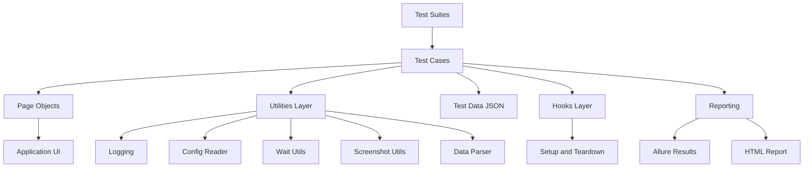

# Playwright JS Automation Framework Architecture

## Application Under Test
- Website: SauceDemo
- URL: https://www.saucedemo.com
- Reason: Widely used, reputable, and stable for UI automation practice.

## Architecture Diagram

## Key Layers

1. Test Layer
- Located in tests/e2e
- Contains business-level scenarios and assertions.

2. Page Object Layer
- Located in pages
- Encapsulates locators and actions per page.

3. Utilities Layer
- Located in utils
- Includes logging, config, waits, screenshots, data parsing, and navigation helpers.

4. Data Layer
- Located in data
- JSON-based inputs for data-driven tests.

5. Hooks Layer
- Located in tests/hooks
- Global and per-test setup/teardown, logging, and failure artifacts.

6. Reporting Layer
- Allure and Playwright HTML reporters.
- Screenshots, traces, and videos retained for failures.
